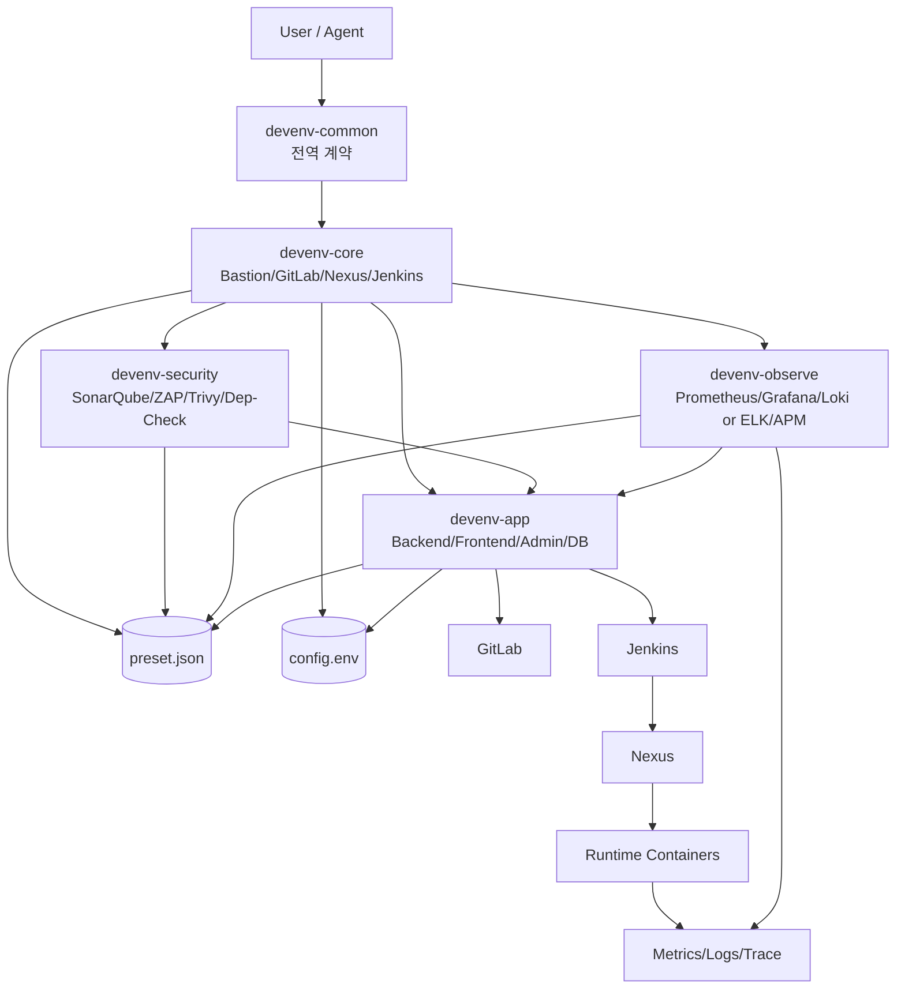

# si-devops — 개발 인프라 스킬 세트

> **Claude Code 마켓플레이스 플러그인** | 퍼블리셔: romis
>
> Bastion·GitLab·Nexus·Jenkins(core) + SonarQube·ZAP·Trivy(security) + Prometheus·Grafana·Loki·SkyWalking(observe) + 앱 레이어(app)를 단계적으로 구축하는 스킬 모음입니다.
>
> 설치 후 `/si-devops:devenv-core`, `/si-devops:devenv-security`, `/si-devops:devenv-observe`, `/si-devops:devenv-app` 으로 각 스킬을 호출합니다.

---

## 시스템 요구사항 (single 모드 기준)

| 항목 | 최소 | 권장 |
|------|------|------|
| CPU | 8 core | 16 core |
| RAM | 24 GB | 32 GB (GitLab 4g + Jenkins 1g + Nexus 2g + OS·Docker 오버헤드 포함) |
| 디스크 | 200 GB SSD | 500 GB SSD (Nexus artifact + GitLab repo + Docker layer 캐시) |
| OS | Ubuntu 22.04 / Debian 11 / WSL2 Ubuntu-22.04 | 동일 |
| 사전 도구 | Docker 20.10+, docker compose v2, openssl 1.1.1+, envsubst, netcat | 동일 |

> security/observe/app 동시 설치 시 RAM 16 GB+ 별도 가산. 모드별·서버별 상세 표는 [`skills/devenv-core/references/prerequisites.md`](skills/devenv-core/references/prerequisites.md) §2.

---

# devenv 통합 가이드

`devenv`는 개발 인프라를 단계적으로 구축하는 스킬 세트입니다.  
핵심 목표는 다음 3가지입니다.

- 설치 성공률 향상 (레이어 분리 + 단계별 검증)
- 장애 복구 시간 단축 (부분 재시도 + 비파괴 기본 정책)
- 운영 일관성 확보 (`devenv-common` 계약 기반 공통 동작)

---

## 1. 전체 구조 한눈에 보기



---

## 2. 모듈별 책임

### `devenv-common`

- 전역 계약(출력/재시도/헬스체크/포트 정책) 적용
- 스킬 간 충돌 정책 정렬

### `devenv-core`

- 기반 4대 서버 설치/기동
- 산출물 생성: compose, 설치 스크립트, `config.env`
- 포트 충돌 자동 회피(가용 포트 탐색)
- Git 안의 `skills/devenv-core/scripts/`는 **`generate-configs.sh` / `verify-generator.sh`** 중심이며, `install-all.sh` 등 **대부분의 설치 스크립트는 `${DEVENV_HOME}`에 생성**됩니다.
- 스킬 문서는 `skills/devenv-core/SKILL.md` **빠른 탐색**과 `skills/devenv-core/references/README.md`로 찾습니다.

### `devenv-security`

- SAST/DAST/SCA/이미지 스캔 구성
- Jenkins 파이프라인 보안 게이트 연동
- 실행 절차는 `skills/devenv-security/SKILL.md` **빠른 탐색**과 `skills/devenv-security/references/README.md`를 봅니다.

### `devenv-observe`

- 메트릭/로그/APM 스택 구성
- Grafana datasource/dashboard 프로비저닝
- 실행 절차는 `skills/devenv-observe/SKILL.md` **빠른 탐색**과 `skills/devenv-observe/references/README.md`를 봅니다.

### `devenv-app`

- 앱/DB/Repo/CI-CD 자동 구성
- GitLab -> Jenkins -> Nexus -> Deploy -> Smoke 연결
- 실행 절차·함정은 `skills/devenv-app/SKILL.md` 상단 **빠른 탐색**과 `skills/devenv-app/references/README.md`에서 파일을 고릅니다.

---

## 3. 권장 실행 순서

아래 순서를 기본으로 사용하세요.

1. `devenv-common` 정책 적용
2. `devenv-core` 설치
3. `devenv-security` 설치 (선택)
4. `devenv-observe` 설치 (선택)
5. `devenv-app` 설치
6. 최종 health/integration/smoke 검증

이 순서를 지키면 실패 범위를 좁히고 재시도 비용을 줄일 수 있습니다.

---

## 4. 핵심 파일과 상태 저장소

### `preset.json` (공유 상태)

- 여러 스킬이 공유하는 상태 파일
- 각 스킬은 자기 섹션(`core/security/observe/app`)만 갱신
- 민감정보 포함 가능하므로 권한 보호 필요

### `config.env` (실행 변수)

- 주로 core/app 스크립트가 참조
- 포트/IP/버전/레지스트리/자격증명 등 운영 파라미터 보관
- single/multi 자동 계산 결과 저장

---

## 5. 운영 원칙 (요약)

- 단계 게이트: `preflight -> install -> health -> integration -> smoke`
- 비파괴 우선: 정상 리소스는 유지, 불필요한 재생성 금지
- 부분 재시도 우선: 실패한 항목만 재시도
- 근거 중심 실패 보고: 실패 단계 + HTTP code + tail log
- compact 출력 기본: 성공은 짧게, 실패만 상세

---

## 6. 포트 충돌 정책

현재 core 생성기는 포트 충돌을 자동 처리합니다.

- 기본 포트 점유 시 가용 포트 탐색
- 최종 포트를 `config.env`에 확정 반영
- compose/health-check/post-install 경로까지 동일 변수 사용

효과:

- 설치 직전 충돌로 인한 중단 감소
- 설정/실행 포트 불일치 리스크 감소

---

## 7. 세션 전략 (토큰 최적화)

결론: **분리 실행 권장** (core, security, observe, app 각각 독립 요청)

### 분리 실행이 유리한 이유

- 실패 시 해당 단계만 재시도 가능
- 컨텍스트 길이가 짧아 응답 안정성 향상
- 변경 추적(로그, 설정, 산출물)이 쉬움

### 단일 세션이 유리한 경우

- PoC 1회성 설치
- 대부분 완료된 환경의 마무리 튜닝

---

## 8. 프롬프트 템플릿

### 8.1 공통 정책 선언 (세션 시작 1회)

```text
이번 작업은 토큰 최적화 모드로 진행해줘.
- OUTPUT_MODE=compact
- 질문은 한 번에 하나씩
- 성공 로그는 1줄 요약
- 실패 시에만 마지막 로그 50줄
- 이미 정상인 항목은 skip(existing-ok)
```

### 8.2 스킬별 호출 (single / multi 공통)

스킬 이름과 모드만 바꿔서 호출합니다. 실패한 항목만 3회(5s/10s/20s) 재시도, 최종 상태만 요약.

```text
[core]    devenv-core를 <single|multi> 모드로 설치해줘. preflight → install → health 순서, 포트 충돌 시 자동 대체.
[security] devenv-security를 빠른 시작으로 설치해줘. <multi 모드면: 보안 서버 IP 분리 + core 엔드포인트 연결>
[observe]  devenv-observe를 기본 스택(prometheus+grafana+loki+skywalking)으로 설치해줘. <multi 모드면: monitoring/apm IP 분리>
[app]      devenv-app을 실행해 backend/frontend/admin + DB → gitlab push → jenkins job → first build → smoke까지.
```

### 8.3 초압축 (전체 일괄)

```text
<single|multi> 모드로 core → (security) → (observe) → app 순서 설치해줘.
compact 출력, 실패 로그 50줄, existing-ok skip, 실패 항목만 재시도.
마지막에 URL/포트/다음 액션 3개만 요약해줘.
```

---

## 9. 장애 대응 체크리스트

- 포트 충돌: 대체 포트 반영 여부(`config.env`) 확인
- 인증 실패: GitLab/Jenkins/Nexus 토큰/비밀번호 동기화 확인
- 헬스체크 실패: endpoint 기준으로 재검증 (컨테이너 up만으로 성공 판정 금지)
- 커널/리소스: `vm.max_map_count`, 메모리, 디스크 여유 확인
- 재실행 전략: 전체 재실행보다 실패 항목 재시도 우선

---

## 9.5 이 스킬이 안 맞는 경우

다음 환경/요구사항이라면 본 스킬보다 다른 도구를 우선 검토하세요.

- **Kubernetes 우선 환경**: 본 스킬은 docker compose 단일 호스트가 기본 컨텍스트. K8s는 Helm chart / Kustomize / ArgoCD 권장. (`devenv-k8s` 스킬은 v1.2 로드맵)
- **클라우드 매니지드 서비스 선호**: GitLab.com SaaS, AWS CodeBuild/CodeArtifact, GCP Artifact Registry 등을 이미 사용 중이라면 자체 호스팅 부담만 늘어남. (`devenv-cloud` 스킬은 v1.3 로드맵)
- **완전 에어갭 / 폐쇄망 (부분 지원)**: 미러 레지스트리·NVD DB 동기화 등은 [`devenv-security/references/airgap.md`](skills/devenv-security/references/airgap.md) 가이드만 있고 완전 자동화는 안 됨.
- **24 GB 미만 호스트 (개인 PC 등)**: 위 시스템 요구사항 미만에서는 GitLab/Jenkins 동시 기동이 어려움. 클라우드 VM 또는 더 큰 머신 권장.
- **단일 앱 dev container**: 백엔드 1개를 docker compose로 띄우는 정도의 케이스는 본 스킬이 과함. 개별 compose 파일 1개로 충분.

---

## 10. 디렉토리 구조

```text
si-devops/                   ← 플러그인 루트
├─ .claude-plugin/
│   └─ plugin.json           ← 플러그인 메타데이터 (name: si-devops, author: romis)
├─ skills/
│   ├─ devenv-common/        ← 전역 계약 (내부용)
│   ├─ devenv-core/          ← Bastion·GitLab·Nexus·Jenkins
│   ├─ devenv-security/      ← SonarQube·ZAP·Trivy·Dep-Check
│   ├─ devenv-observe/       ← Prometheus·Grafana·Loki·SkyWalking
│   └─ devenv-app/           ← 앱·DB·CI/CD
└─ README.md
```

각 스킬의 상세 동작 계약은 `skills/<skill-name>/SKILL.md`를 기준으로 확인하세요.


